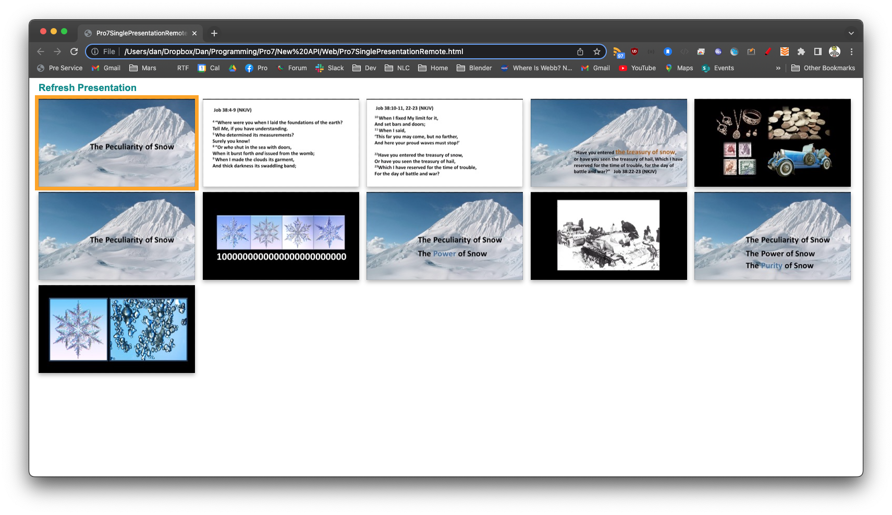

# Pro7SinglePresentationRemote
A simple web app for someone to view and control a **single** specific presentation in Pro7

Allows control of a **single** presentation _(currently by using a hard coded name in the script source)_.
The idea is that any device with a web browser can load this simple .html file to view the current Pro7 presentation as a grid of slide thumbnails - and if the current presentation has the right name - they are allowed to control it (click/tap any slide to trigger it).
If the current presentation does not have the correct name to be controllable - they will see a "ghosted" version of it.

Update the following hardcoded values in the script to suit your Pro7 machine:
var ipAddressOfProPresenterComputer = '127.0.0.1' // Hostname can used used here also if you have hostname resolution for your ProPresenter computer
var networkPortOfProPresenter = '50001' // See ProPresenter network prefs
var nameOfPresentationToControl = "Message" // This web page will be able to control a presentation is the name matches

And then open in your fav web browser.
