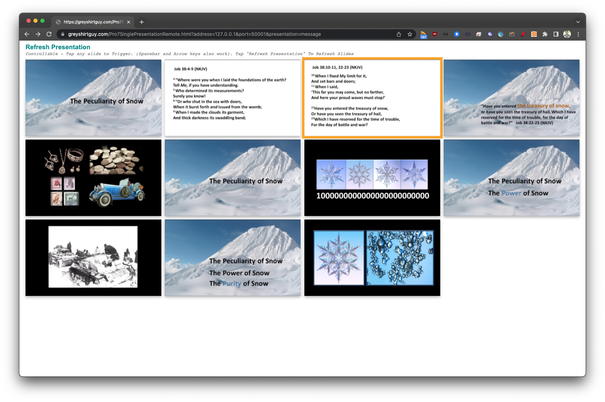

# Pro7SinglePresentationRemote
A simple web app for someone to view and control a **single** specific presentation in Pro7


Allows control of a **single** presentation in Pro7 (using new API in versions 7.9 and later)
The idea is that any device with a web browser can load this simple .html file to view the current Pro7 presentation as a grid of slide thumbnails - and if the current presentation has the right name - they are allowed to control it (click/tap any slide to trigger it).
If the current presentation does not have the correct name to be controllable - they will see a "ghosted" version of it and cannot control it.

It's all in a single .html file - just open the Pro7SinglePresentationRemote.html in any modern web broswer!

You must include the following query strings in the URL to connect to ProPresenter:
```
address=[Network address of ProPResenter] (See Network Preferences)
port=[Network port of ProPResenter] (See Network Preferences)
presentation=[Name of presentation to allow control]
```

You can optionally include the following query string in the URL to control the image quality:
```
quality=[Quality of thumbnail images is the width in pixels of the image data (defaults to 600 if not provided)]
```

Click any slide to trigger it (Space Bar and Arrow keys also work!)

Tip: To use this on an iPad you will need to host it on a webserver that the iPad can access.
I have hosted at my personal website to enable this for users that cannot host it themselves.
http://pro7api.greyshirtguy.com/Pro7SinglePresentationRemote.html
Please note this is BETA and make change/break at any time!

Example URL to connect to ProPresenter 7 with ip address 192.168.1.7 and port 50001 and control the presentation that is called "Message":

http://pro7api.greyshirtguy.com/Pro7SinglePresentationRemote.html?address=192.168.1.7&port=50001&presentation=message

(Does not work in desktop browsers - due to security restrictions)
